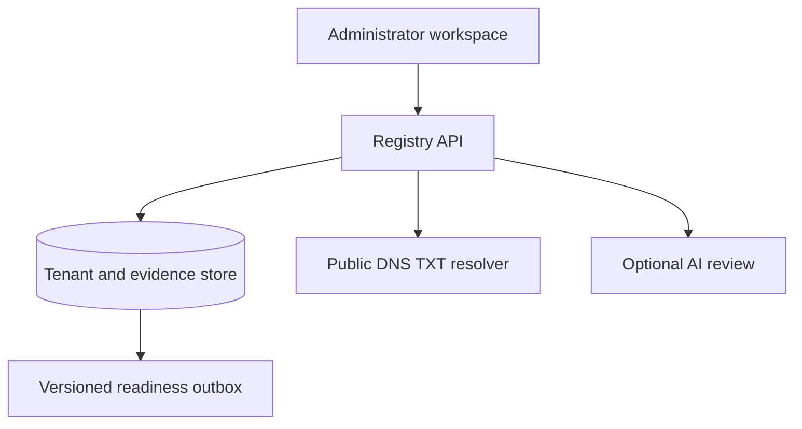

# Protected Tenant Registry — operating blueprint

The current manual process has not yet been provided. This blueprint uses the six control areas in the request as the initial workflow. It can be reconciled against the real approval chain and provisioning systems when those details arrive.

## Architecture and data schema

`protected_tenants` holds one versioned configuration per slug and environment. `tenant_changes` holds proposed changes, classifications, reasons, and review decisions. `tenant_validations` stores each DNS check and evidence. `tenant_audit` records actions as append only events. `tenant_outbox` stores readiness events for downstream provisioning consumers. No runtime migration creates these tables; the generated `0013` migration owns the schema.

## AI-infused workflow map

| Step | Mode | New process | Evidence and gate |
| --- | --- | --- | --- |
| 1 | [Manual] | Administrator creates a Draft tenant with name, slug, environment, and optional domain. | Actor, version, and creation event recorded. |
| 2 | [Automated] | API rejects raw credentials and accepts only opaque `secret-ref://` and `kms-ref://` identifiers. | Validation occurs before any record or change note is stored. |
| 3 | [Automated] | New or approved changed domain gets a fresh challenge; a DNS TXT check runs immediately. | Each check stores query, result, duration, and timestamp. The resolver reads public DNS only. ([Cloudflare DNS JSON API](https://developers.cloudflare.com/1.1.1.1/encryption/dns-over-https/make-api-requests/dns-json/)). |
| 4 | [AI-Enhanced] | Rule analysis checks completeness, domain status, region, isolation, realm alignment, and reference presence. Optional model review summarizes risk when a server-side key exists. | Recommendations are advisory; no model output grants readiness. |
| 5 | [Manual] | Administrator proposes controlled metadata changes with a reason. Another authorized administrator must approve Production changes. | Pending proposal, classification, original version, review decision, and actor retained. |
| 6 | [Automated] | Approved changes increment version and re-run validation if the domain changed. Stale proposals are rejected. | Audit records version transition and DNS evidence. |
| 7 | [Automated] | Alerts surface stalled validation, missing region, realm mismatch, and absent references. | Health and alerts refresh from stored records. |
| 8 | [Manual] | Administrator reviews readiness and queues the exact version for downstream provisioning. | `tenant.ready` outbox event is recorded. A provisioning adapter still needs to consume it. |
| 9 | [Manual] | Export tenant change, validation, and audit evidence for review. | JSON evidence package includes timestamps and event identifiers. |

## Suggested stack

| Need | Current implementation | Expansion option |
| --- | --- | --- |
| Governed UI | HavenConnect React and Shadcn components | Retool or v0 for separate internal tools or UI iteration; keep server-side authorization in the API. |
| Metadata and audit | Existing Cloudflare D1 with new indexed tables | PostgreSQL when multi-region and complex cross-service reporting become necessary. |
| Domain validation | Fixed Cloudflare DNS-over-HTTPS TXT query | Secondary resolver, retry scheduler, and certificate/hosting verification. |
| AI recommendations | Rule checks; optional OpenAI review when configured | Azure OpenAI or Claude through a governed model router after data handling review. |
| Automation | Inline validation and a persistent outbox | n8n, Make, or Zapier for non-sensitive notifications; durable workers/event bus for provisioning and approvals. n8n supports workflow executions and retries. ([n8n execution documentation](https://docs.n8n.io/workflows/executions/all-executions/)). |
| Monitoring | Registry KPI cards and alerts | Grafana alert rules for operational signals; Power BI for governed cross-tenant reports. ([Grafana alerting](https://grafana.com/docs/grafana/latest/alerting/); [Power BI REST API](https://learn.microsoft.com/en-us/rest/api/power-bi/)). |

The optional model key is not currently configured on this Site. The deterministic checks and workflow actions operate without it. Vault references are syntax checked, but their existence and permissions are **not** verified until a vault/KMS adapter is connected. The `tenant.ready` outbox is a real, durable handoff record, but no downstream provisioning worker is connected; it must never be interpreted as an activated tenant.

## Dashboard wireframe and KPIs

The header shows the protected role, refresh control, tenant and environment selector, and health status. The health view displays tenant count, verified domains, region coverage, isolation coverage, realm alignment, and reference presence. Clicking a tenant opens its controlled configuration. Domain validation shows the TXT challenge and every check; governance shows pending changes and the downstream queue; audit shows an exportable event table.

All KPI denominators are the configured tenant records in this registry. **Isolation compliance** currently means a mode was selected; actual physical isolation must be attested during provisioning. **Encryption integrity** currently means both opaque references are present and syntactically valid; the vault check remains a separate gate. **Identity alignment** is a slug match heuristic, not proof that an identity provider is configured. Validation duration is measured for DNS checks, while end-to-end configuration change time can be derived from proposal and review timestamps.

Proactive alerts include: validation stalled 15 minutes after a metadata change, an isolation mode with no region, a realm that does not include the tenant slug, and incomplete encryption references. A future forecasting job can use enough historical validation runs to predict likely delays; the current rules do not claim predictive accuracy.

## Operational boundaries

- The registry is restricted to the existing HavenConnect administrator allowlist. Production approvals require a distinct authorized reviewer.
- DNS TXT validation proves control of the challenge name. It does not attach a domain to the hosted site, issue a certificate, or prove identity-realm ownership.
- No raw secret, KMS key material, or provider credential belongs in tenant metadata. Only references are stored.
- No automatic provisioning, isolation claim, or regulatory certification is inferred from a green registry score. A downstream consumer must perform and record those checks before activation.
